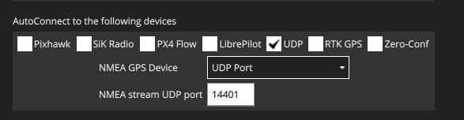

# Simulation through PX4 Docker container
## Table of Contents
- [Simulation through PX4 Docker container](#simulation-through-px4-docker-container)
  - [Table of Contents](#table-of-contents)
  - [General information](#general-information)
  - [Setup](#setup)
  - [How to use - HITL](#how-to-use---hitl)
  - [How to use - SITL](#how-to-use---sitl)
  - [Compile a Gazebo Plugin](#compile-a-gazebo-plugin)
  - [Build Custom Firmware](#build-custom-firmware)

## General information
:new: The simulation was implemented using [PX4 Docker containers](https://docs.px4.io/main/en/test_and_ci/docker.html). This way, you are not bound to the version of linux installed on your PC.

In order to correctly run the simulation **after** following the following guide, the working directory tree will be organised as follows:
```
HITL-Simulation/
├── assets			            // Useful images
├── FlightSimulations           // Folder containing flight simulations data and relative images
├── gazebo_plugin		        // Gazebo plugin to simulate motor delay
├── PX4-Autopilot		        // PX4 source code
├── GSimulation			        // Convenience script to run docker container
├── QGroundControl.AppImage	    // QGroundControl application
├── README.md			        // README
```

## Setup
1. Download the **PX4 source code** in the current directory.
    ```bash
    git clone https://github.com/PX4/PX4-Autopilot.git --recursive
    ``` 
2. **Install Docker**  :whale: \
    For local installation on Ubuntu, the quickest and easiest way to install Docker is to use the [convenience script](https://docs.docker.com/engine/install/ubuntu/#install-using-the-convenience-script):
    ```bash
    curl -fsSL get.docker.com -o get-docker.sh
    sudo sh get-docker.sh
    ```
    The default installation requires that you invoke Docker as the root user (i.e. using `sudo`). However, for building the PX4 firmware we suggest to use [docker as a non-root user](https://docs.docker.com/engine/install/linux-postinstall/#manage-docker-as-a-non-root-user) . That way, your build folder won't be owned by root after using docker.
    ```bash
    # Create docker group (may not be required)
    sudo groupadd docker
    # Add your user to the docker group.
    sudo usermod -aG docker $USER
    # Log in/out again before using docker!
    ```
    The available PX4 containers are on [Github here](https://github.com/PX4/PX4-containers/blob/master/README.md#container-hierarchy). The one chosen to carry out the simulation is `px4io/px4-dev-ros-noetic` which is primarily targeted at the Ubuntu 20.04 (Focal) release.

    A conveniance shell script [GSimulation](/GSimulation) has been already prepared. This script runs a Docker container that has support for X forwarding (makes the simulation GUI available from inside the container). It maps the directory `/PX4-Autopilot` from your computer to `/src/PX4-Autopilot` inside the container.

    Therefore, to start a docker session and open a bash shell in the container just run:
    ```bash
    ./GSimulation
    ```
    to open a new bash shell in this container just type:
    ```bash
    docker exec -it px4-ros bash
    ```
3. **Install QGC** - [Link](https://docs.qgroundcontrol.com/master/en/qgc-user-guide/getting_started/download_and_install.html)
    - On the command prompt enter:
        ```bash
        sudo usermod -a -G dialout $USER
        sudo apt-get remove modemmanager -y
        sudo apt install gstreamer1.0-plugins-bad gstreamer1.0-libav gstreamer1.0-gl -y
        sudo apt install libfuse2 -y
        sudo apt install libxcb-xinerama0 libxkbcommon-x11-0 libxcb-cursor0 -y
        ```
    - Logout and login again to enable the change to user permissions
    - Download latest QGC release [HERE](https://d176tv9ibo4jno.cloudfront.net/latest/QGroundControl.AppImage) in the current directory
    - Install (and run) using the terminal commands:
        ```bash
        chmod +x ./QGroundControl.AppImage
        ./QGroundControl.AppImage  (or double click)
        ```
4. **HITL Set-up**\
    Setting up HITL - PX4 configuration - [Link](https://docs.px4.io/main/en/simulation/hitl.html)

    1. Plug in the flight controller, open QGC, go to setup -> safety-> enable hitl

    2. Change airframe to HITL Quadcopter (or [compatible ariframe](https://docs.px4.io/main/en/simulation/hitl.html#compatible_airframe)) and reboot Pixhawk
        1. If it doesn’t change you need to update the firmware from FMUv2 to FMUv3
        2. Flash the latest PX4 stable firmware, then go to parameters and set SYS_BL_UPDATE=1 and reboot Pixhawk - [Link](https://docs.px4.io/main/en/config/firmware.html)
        3. Flash again the latest version and now it should be FMUv3, then change airframe
    3. In QGC Application settings, in the AutoConnect tab select only UDP (so that it will only connect to the simulator).
   
5. **SITL Set-up**\
   For SITL simulation you **don't** have to plug in the flight controller. Just open QGC and it automatically will connect to the Simulator.
   

## How to use - HITL
**Note:** Make sure QGroundControl is **not** running!
1. Run the convenience script to start a docker session
    ```bash
    ./GSimulation
    ```
2. If everything went well you should be in a new bash shell now.\
Build PX4 with Gazebo Classic (in order to build the Gazebo Classic plugins):
    ```bash
    cd src/PX4-Autopilot
    DONT_RUN=1 make px4_sitl_default gazebo-classic
    ```
3. Set up the environment variables:
    ```bash
    source Tools/simulation/gazebo-classic/setup_gazebo.bash $(pwd) $(pwd)/build/px4_sitl_default
    ```
4. Run Gazebo Classic in HITL mode:
    ```bash
    gazebo Tools/simulation/gazebo-classic/sitl_gazebo-classic/worlds/hitl_iris.world
    ```
5. Open *QGroundControl* from the host. It should autoconnect to PX4 and Gazebo Classic through UDP. You can make the drone fly inside gazebo sending commands from QGC.

## How to use - SITL   
**Note:** Make sure QGroundControl is **not** running!
1. Run the convenience script to start a docker session
    ```bash
    ./GSimulation
    ```
2. If everything went well you should be in a new bash shell now.\
   The build system makes it very easy to build and start PX4 on SITL, launch a simulator, and connect them. The syntax (simplified) looks like this:
    ```bash
    make px4_sitl simulator[_vehicle-model]
    ```
    E.g to build PX4 iris model with Gazebo Classic type in the bash shell:
    ```bash
    cd src/PX4-Autopilot
    make px4_sitl gazebo-classic_iris
    ```
3. Open *QGroundControl* from the host. It should autoconnect to PX4 and Gazebo Classic through UDP. You can make the drone fly inside gazebo sending commands from QGC.


## Compile a Gazebo Plugin

Motors are defined as gazebo plugins in the drone model. A plugin contains a set of methods that define its behaviour, for example when the plugin receives some velocities it makes the rotors move and so on. In general, the plugin must be written in C++ and then compiled as binary which is then used by the simulator.

Gazebo API Documentation - [Link](https://classic.gazebosim.org/api)

- Edit the Drone model
    - For **HITL** simulations edit the Drone model ***iris_hitl***:\
    `PX4-Autopilot/Tools/simulation/gazebo-classic/sitl_gazebo-classic/models/iris_hitl/iris_hitl.sdf`\
    - For **SITL** simulations edit the Drone model ***iris***:\
    `PX4-Autopilot/Tools/simulation/gazebo-classic/sitl_gazebo-classic/models/iris/iris.sdf` 

    the main changes done here are adding the parameter  `<latency>10</latency>`  to each motor plugin (`front_right_motor_model`, `front_left_motor_model`, `back_left_motor_model`, `back_right_motor_model`)\
    and modifying each motor link pose (e.g. `<link name='rotor_0'> <pose>0.55 -0.395 0 0 0 0</pose>`)
  
- Motor model header:\
   you can replace `PX4-Autopilot/Tools/simulation/gazebo-classic/sitl_gazebo-classic/include/gazebo_motor_model.h` with [gazebo_motor_model.h](/gazebo_plugin/gazebo_motor_model.h)\
   The main changes done here are adding the following part of code:
   ```c
   double latency_
   std::deque<double> motor_velocity_buffer_;
   ```
  
- Plugins folder: `PX4-Autopilot/Tools/simulation/gazebo-classic/sitl_gazebo-classic/src`\
  This is the main part of the simulation modification.\
  Here we add the new file [gazebo_motor_model_delay.cpp](/gazebo_plugin/gazebo_motor_model_delay.cpp) which is a modified version of the default code `gazebo_motor_model.cpp`.\
  It consists of the following code snippets that simulate the motor latency implementing a FIFO buffer:
  ```c++
  // Add latency before actuating the motors
    if (_sdf->HasElement("latency")) {
        // retrieves its value and assigns it to the variable latency_, dividing by 
        // 1000.0 to convert it from milliseconds to seconds
        latency_ = _sdf->GetElement("latency")->Get<double>()/1000.0;
    }
    else {
        // If the parameter is not defined, sets latency_ to 0.0
        latency_ = 0.0;
    }
    //0.004 is the max step size of gazebo world
    // Set the size of the buffer based on the desired latency and the simulation step size
  motor_velocity_buffer_.resize(static_cast<int>(latency_ / 0.004));
  ```
  
- CMakeList: `PX4-Autopilot/Tools/simulation/gazebo-classic/sitl_gazebo-classic/CMakeLists.txt`\
  Here for sake of simplicity we modify the following line:
  ```cmake
  add_library(gazebo_motor_model SHARED src/gazebo_motor_model.cpp)
  ```
  to
  ```cmake
  add_library(gazebo_motor_model SHARED src/gazebo_motor_model_delay.cpp)
  ```


To modify and compile and existing plugin: 

1. Copy the plugin you want to modify in the same folder and rename it
2. Modify the C++ code, declare variables in the motor model header if possible
3. Add in the CMakeList file the new plugin reference to be compiled, for example
    ```makefile
    add_library(gazebo_motor_model SHARED src/gazebo_motor_model_delay.cpp)
    ```
4. Build again the model (it will update only the modified files)
    ```bash
    cd src/PX4-Autopilot
    DONT_RUN=1 make px4_sitl_default gazebo
    ```

5. Open Gazebo to see the changes (you can right click on the model > edit model to view all the installed plugins)

## Build Custom Firmware

Follow the steps [here](https://docs.px4.io/main/en/modules/hello_sky.html)